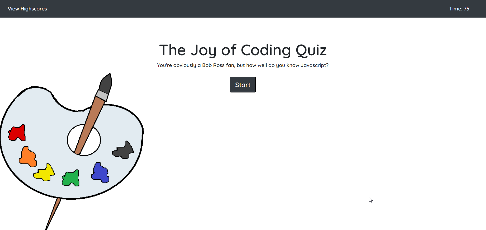
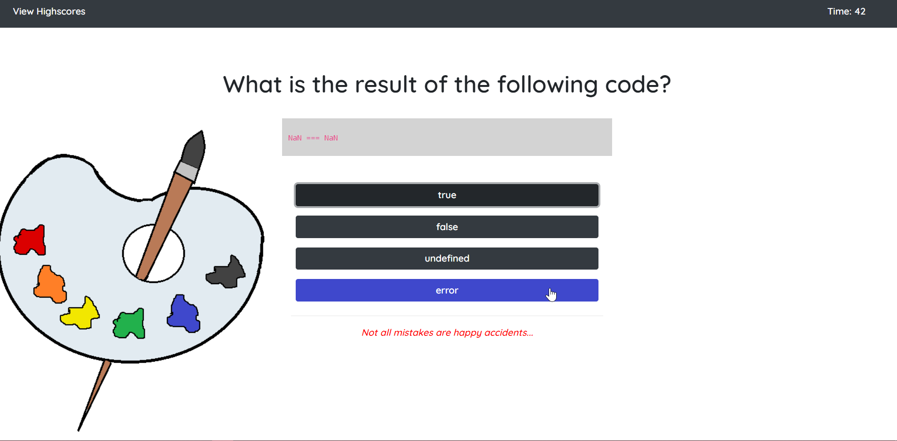

# 04-Web-APIs-Code-Quiz

## Deployed Site:

https://darnocer.github.io/04-Web-APIs-Code-Quiz/

## Description

This quiz is a simple Bob Ross-themed quiz with five questions about Javascript.

The rules for the quiz are as follows:

- Click "Start" to begin the timer and go to the first question

* You have 75 seconds to answer 5 multiple choice questions about js

- Answer the question correctly and score 15 points.
- Answer the question incorrectly and lose 15 points and also 15 seconds from your time.
- Time matters: You final score is your net score plus the remaining time.
- Enter your initials to save your score to the high scores board

This application uses `localStorage` to store and retrieve high scores.





## Acceptance Criteria

```
GIVEN I am taking a code quiz
WHEN I click the start button
THEN a timer starts and I am presented with a question
WHEN I answer a question
THEN I am presented with another question
WHEN I answer a question incorrectly
THEN time is subtracted from the clock
WHEN all questions are answered or the timer reaches 0
THEN the game is over
WHEN the game is over
THEN I can save my initials and score
```
