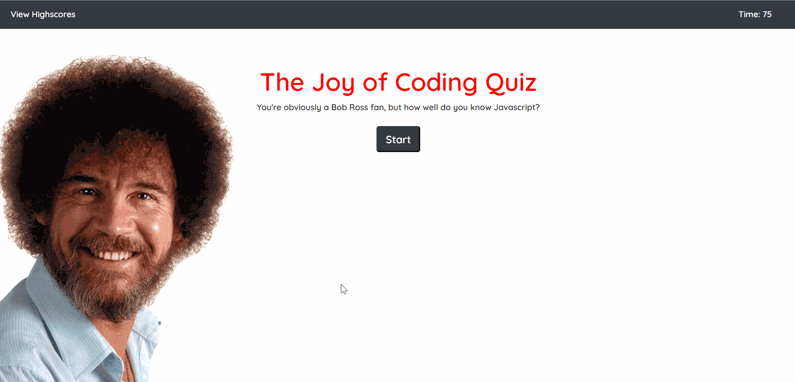

# Javascript Code Quiz

 

### URL: https://darnocer.github.io/Web-APIs-Code-Quiz/

## Description

This quiz is a simple Bob Ross-themed quiz with five questions about Javascript.

## Table of Contents

- [Installation](#installation)
- [Usage](#usage)
- [Credits](#Credits)
- [Tests](#tests)
- [Questions](#questions)

## Usage

- Click "Start" to begin the timer and go to the first question
- You have 75 seconds to answer 5 multiple choice questions about js
- Answer the question correctly and score 15 points.
- Answer the question incorrectly and lose 15 points and also 15 seconds from your time.
- Time matters: You final score is your net score plus the remaining time.
- Enter your initials to save your score to the high scores board

## Credits

- [Bootstrap](https://getbootstrap.com/)

## Questions?

Contact me at [darian.nocera26@gmail.com](mailto:darian.nocera26@gmail.com)

or 

Copyright © 2020 [Darian Nocera](http://www.github.com/darnocer)

---

##### _Created with [darnocer's README generator](https://github.com/darnocer/Node.js-and-ES6-README-Generator)_ 👽
